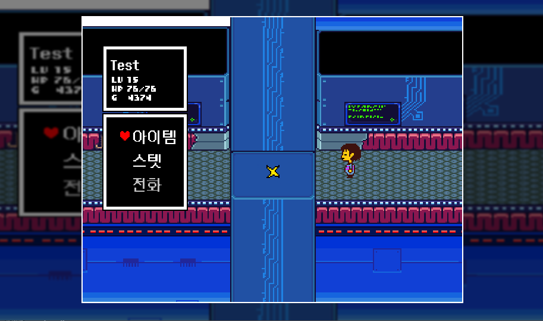
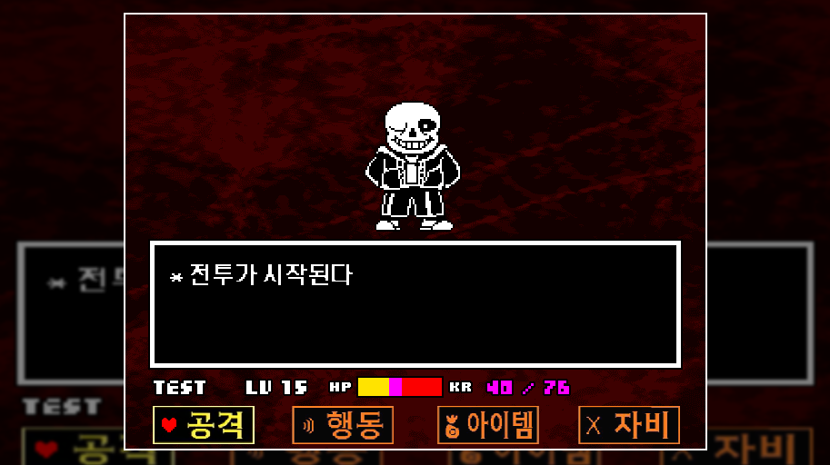

# ❤️ Undertale: The Void Laboratory

  
  
  
<b>『공허 속에 과학자』</b>

  
Godot 엔진으로 제작한 언더테일 팬게임

## 📖 스토리
몰살의 길을 걷던 주인공(LV 15)은 코어에서 어느 날 이상한 현상을 발견합니다. 평소와 달리 몬스터들이 아무도 보이지 않는 것입니다. 갈림길에서 연구소로 향하는 샌즈를 발견하고 그를 따라가는 주인공은 이제 예상치 못한 그림자가 드리워진 이야기 속에 발을 들이게 됩니다.

> *"모든 시간선이 하나로 수렴하는 지점이 있어. 그곳이 바로 공허야."*

어둠 속에 감춰진 진실의 연구소 속 주인공은 잊혀진 과학자 W.D. 가스터의 흔적과 그가 남긴 기록을 발견하게 됩니다. 샌즈, 플라위, 그리고 가스터 사이에 얽힌 숨겨진 관계와 계획이 서서히 드러납니다.

### 🌟 당신의 선택이 세계를 결정합니다
- **의지의 힘**: 당신의 LV와 선택에 따라 이야기의 흐름이 달라집니다
- **다중 엔딩**: 세 가지 주요 결말과 숨겨진 이스터 에그를 찾아보세요
- **숨겨진 진실**: 표면적으로 보이는 것이 전부가 아닙니다. 진짜 이야기는 더 깊은 곳에...
- **융합체들의 메시지**: "그가 돌아왔어..."

### 💀 주요 등장인물
- **샌즈**: *"kid... 난 네가 얼마나 알고 있는지 궁금해. 어쩌면 넌 이미 알고 있을지도..."*
- **W.D. 가스터**: *"흥미롭군... 네 영혼에 담긴 의지가... 내가 필요로 하던 바로 그것이야."*
- **플라위**: *"난 네가 단순히 모든 걸 죽이기만 할 줄 알았는데... 어쩌면 우리는 잠시 동맹을 맺을 수 있을지도."*

### 🔍 게임 특징
- **원작의 정통 전투 시스템**: 탄막을 피하고 전략적으로 행동을 선택하세요
- **새로운 영역 탐험**: 공허의 연구소에 숨겨진 비밀방과 기록을 발견하세요
- **선택과 결과**: 당신의 모든 결정이 세계의 운명을 바꿉니다
- **숨겨진 대화**: 특정 조건에서만 볼 수 있는 특별한 대화를 찾아보세요

  
게임 스크린샷

  
  

## 🎮 게임 조작
- **방향키**: 이동/메뉴 선택
- **Z / 엔터 / 스페이스**: 확인/대화/공격
- **X**: 취소/메뉴 닫기
- **C**: 메뉴 열기
- **SHIFT**: 인트로/대사 스킵

## 🛠️ 개발 정보
- **엔진**: Godot Engine 4.2
- **해상도**: 640x480
- **플랫폼**: PC (Windows)

  
<i>"공허 속에서 잊혀지지 않은 것은 무엇일까...? 그리고 그것은 어떤 대가를 요구할까...?"</i>

