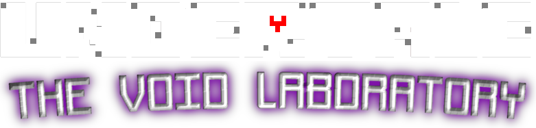

# ❤️ Undertale: The Void Laboratory

  
  
  
Godot 엔진으로 제작한 언더테일 팬게임

## 📖 스토리
공허(Void)로 인해 이상한 언더테일 차원으로 오게된 인간이 진실의 연구소에서
시간과 공간이 왜곡된 이곳에서 변해버린 가스터와 그를 되찾으려는 샌즈의 이야기를 경험하게 됩니다.

### 🎮 게임 조작
- 반향키로 이동
- c
  - 메뉴
- x
  - 취소
- 엔터, 스페이스, z
  - 선택
- shift
  - 인트로 스킵
  - 대사 스킵

### 🌟 주요 특징
- 다양한 선택지에 따른 여러 엔딩
- 가스터와의 최종 전투
- 숨겨진 스토리 조각들
- 언더테일 스타일의 전투 시스템

### 💾 세이브 시스템
실험실 곳곳에 설치된 "시간 고정점"이 게임의 세이브 로드를 계속 할수 있게 합니다 이는 가스터의 시간-공간 실험 장치로, 공허의 특성상 일반적인 시간의 
법칙이 적용되지 않는 이곳에서도 세이브/로드가 가능하게 합니다.

### 🎯 게임 목표
- 가스터의 과거와 현재를 이해하기
- 숨겨진 연구 기록 찾기
- 샌즈와 가스터의 관계 파헤치기
- 최종 결말 도달하기

## 🛠️ 개발 정보 (개발중)
- 엔진: Godot Engine
- 해상도: 640x480
- 플랫폼: PC (Windows)